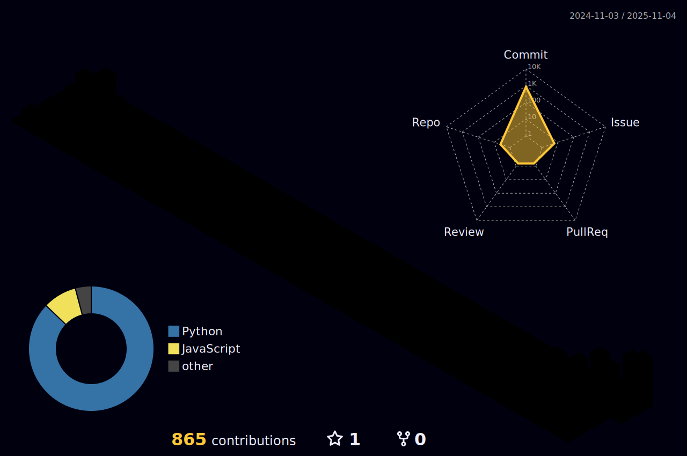

<div align="center">

<!-- ===== HEADER ===== -->


<!-- Typing SVG -->
<a href="https://git.io/typing-svg">
  
</a>

<br/>

<!-- Profile Badges -->
<p>
  
  &nbsp;
  <a href="https://github.com/adabana-saki?tab=followers">
    
  </a>
</p>

<!-- Social Links -->
<p>
  <a href="https://x.com/adasaki_159tech">
    
  </a>
  &nbsp;
  <a href="https://qiita.com/adabana-saki">
    
  </a>
</p>

</div>

<!-- ===== ABOUT ME ===== -->
##  About Me

```python
class BackendEngineer:
    def __init__(self):
        self.name = "adabana-saki"
        self.location = "Japan 🇯🇵"
        self.role = "Backend Engineer"

    @property
    def skills(self):
        return {
            "languages": ["Python", "JavaScript"],
            "backend": ["Flask", "FastAPI", "Discord.py"],
            "ai_ml": ["TensorFlow", "PyTorch", "scikit-learn"],
            "data": ["Pandas", "NumPy", "Matplotlib"],
            "devops": ["Docker", "Git", "PostgreSQL"],
            "cloud": ["Oracle Cloud", "Azure"]
        }

    @property
    def current_focus(self):
        return ["AI/ML", "Data Science", "Bot Development", "Automation"]

me = BackendEngineer()
```

<!-- ===== TECH STACK ===== -->
##  Tech Stack

<div align="center">

<!-- Skill Icons -->
<a href="https://skillicons.dev">
  
</a>

<br/>

<a href="https://skillicons.dev">
  
</a>

<br/><br/>

<details>
<summary><b>📋 Detailed Tech Stack</b></summary>
<br/>

| Category | Technologies |
|:--------:|:-------------|
| **Languages** |   |
| **Backend** |    |
| **AI / ML** |    |
| **Data** |    |
| **DevOps** |    |
| **Cloud** |   |
| **Learning** |   |

</details>

</div>

<!-- ===== GITHUB STATS ===== -->
##  GitHub Stats

<div align="center">

<a href="https://github.com/adabana-saki">
  <picture>
    <source media="(prefers-color-scheme: dark)" srcset="https://github-readme-stats.vercel.app/api?username=adabana-saki&show_icons=true&hide_border=true&bg_color=0d1117&title_color=58a6ff&icon_color=58a6ff&text_color=c9d1d9&ring_color=58a6ff"/>
    
  </picture>
</a>
&nbsp;
<a href="https://github.com/adabana-saki">
  <picture>
    <source media="(prefers-color-scheme: dark)" srcset="https://github-readme-stats.vercel.app/api/top-langs/?username=adabana-saki&layout=compact&hide_border=true&bg_color=0d1117&title_color=58a6ff&text_color=c9d1d9&langs_count=8"/>
    
  </picture>
</a>

<br/><br/>

<!-- Streak Stats -->
<a href="https://github.com/adabana-saki">
  
</a>

</div>

<!-- ===== ACTIVITY GRAPH ===== -->
##  Activity

<div align="center">

[](https://github.com/ashutosh00710/github-readme-activity-graph)

</div>

<!-- ===== CONTRIBUTION SNAKE ===== -->
##  Contribution Snake

<div align="center">

<picture>
  <source media="(prefers-color-scheme: dark)" srcset="https://raw.githubusercontent.com/adabana-saki/adabana-saki/output/github-contribution-grid-snake-dark.svg"/>
  <source media="(prefers-color-scheme: light)" srcset="https://raw.githubusercontent.com/adabana-saki/adabana-saki/output/github-contribution-grid-snake.svg"/>
  
</picture>

</div>

<!-- ===== 3D CONTRIBUTION ===== -->
##  3D Contribution

<div align="center">

<picture>
  <source media="(prefers-color-scheme: dark)" srcset="profile-3d-contrib/profile-night-rainbow.svg"/>
  <source media="(prefers-color-scheme: light)" srcset="profile-3d-contrib/profile-season-animate.svg"/>
  
</picture>

</div>

<!-- ===== TROPHIES ===== -->
##  Trophies

<div align="center">

[](https://github.com/ryo-ma/github-profile-trophy)

</div>

<!-- ===== METRICS ===== -->
##  Metrics

<div align="center">

<a href="https://github.com/adabana-saki">
  
</a>
<a href="https://github.com/adabana-saki">
  
</a>

<br/>

[](https://github.com/vn7n24fzkq/github-profile-summary-cards)

</div>

<!-- ===== QIITA ===== -->
##  Qiita

<div align="center">

[](https://qiita.com/adabana-saki)
&nbsp;
[](https://qiita.com/adabana-saki)

</div>

<!-- ===== QUOTE ===== -->
##  Dev Quote

<div align="center">

[](https://github.com/piyushsuthar/github-readme-quotes)

</div>

<!-- ===== FOOTER ===== -->
<div align="center">

<br/>

###  Let's Connect!

<p>
  <a href="https://x.com/adasaki_159tech">
    
  </a>
  &nbsp;
  <a href="https://qiita.com/adabana-saki">
    
  </a>
  &nbsp;
  <a href="https://github.com/adabana-saki">
    
  </a>
</p>

<br/>


</div>
